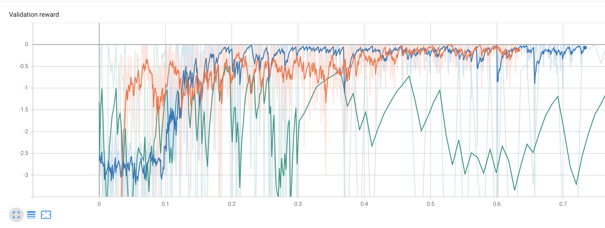

# Bi-Level RL Codebase
This repository provides examples of the Bi-Level RL approach, implemented using stable baselines.
We provide a simple example of solving a network flow problem (in this case just a single commodity, so it is equivalent to the shortest paths problem) using our Bi-level RL approach. You can try different RL algorithms by updating the algorithm in `main_network_flow.py`.

To train a policy for the network flow problem, simply run
python3 `main_network_flow.py`.

</td>  
*Validation reward for the network flow problem. Orange represents A2C, blue represents PPO, and green represents SAC. SAC does not do well for this problem because the reward is sparse.*
